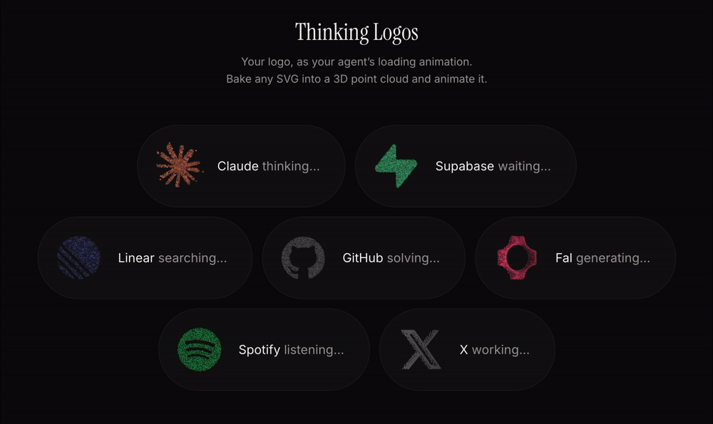

# Thinking Logos

Your logo, as your agent's loading animation. Bake any SVG into a 3D point
cloud and play it as seven loading states — the mark scatters into a working
form while the model thinks, and reassembles into your brand when it lands.



**[Playground](https://thinking-logos.ozturkenes.com)** · [Report an issue](https://github.com/enesozturk/thinking-logos/issues)

Plain 2D canvas. No WebGL, no filters, no runtime dependency beyond React.

## What this is

A fork of **[thinking-orbs](https://github.com/Jakubantalik/thinking-orbs)** by
[Jakub Antalik](https://www.jakubantalik.com). The renderer, the nine procedural
orb states and the depth-through-ink design language are his — **read that repo
for anything about the orbs themselves.** All nine are still exported here,
unchanged, so `ThinkingOrb` remains a drop-in.

This fork adds exactly two things:

1. **A bake pipeline** — artwork in, point cloud out.
2. **Seven logo states** — the orb motions, rebuilt to run on a mark instead of
   a sphere.

The second is the harder half, and the reason this is a fork rather than a
wrapper. An orb state is not a kind of object; it is a motion field that
happened to be written against the geometry it generates. Split those and the
motion is the portable part — it does not care whether a position came from a
Fibonacci lattice or a rasterised trademark. But a sphere reads correctly from
every angle and a mark has exactly one correct appearance, so every state had
to be reshaped around a single rule: **the viewer must always be able to see
what the logo is.** The mark is punctuation, not a resting state — it is
reached at the crest of one long, evenly-paced arc, always face-on, and left
immediately.

## Getting it

There is no package to install. Open the playground, drop your SVG in, pick a
state, and copy the component it generates — one file, React the only import.

```tsx
import { YourMark } from './your-mark';

<YourMark size={64} />;
```

That is not a shortcut. The bake is the only part that needs a DOM, and the
playground has already done it, so the copied file carries the finished point
set and never touches a rasteriser at runtime: no async, no image decode, no
work on the user's first paint.

## The seven states

```tsx
<ThinkingLogo logo={art} state="thinking" />    {/* sphere ⇄ logo — the headline */}
<ThinkingLogo logo={art} state="solving" />     {/* logo → cube → rubik solve → logo */}
<ThinkingLogo logo={art} state="listening" />   {/* logo → a floating body that pulses → logo */}
<ThinkingLogo logo={art} state="searching" />   {/* logo → a sphere swept by a meridian → logo */}
<ThinkingLogo logo={art} state="working" />     {/* logo → a thread wound into a knot → logo */}
<ThinkingLogo logo={art} state="waiting" />     {/* logo → a bellows of stacked rings → logo */}
<ThinkingLogo logo={art} state="generating" />  {/* logo → something being made → logo */}
```

`thinking` is the one to reach for first.

`searching`, `solving`, `listening` and `working` share their verb with an orb
state, so the two can run in one UI and mean the same thing. `thinking`,
`waiting` and `generating` have no orb counterpart.

`generating` is eight forms rather than one, because generation looks like
whatever is being generated. Pick one with `tune`:

```tsx
import { BODY_DIFFUSION } from 'thinking-logos';

<ThinkingLogo logo={art} state="generating" tune={{ body: BODY_DIFFUSION }} />
```

| `body` | the form |
| --- | --- |
| 00 `BODY_LATTICE` | the orb quantised onto a grid |
| 01 `BODY_DIFFUSION` | the orb resolving out of noise |
| 02 `BODY_VOXEL` | a solid of cells, filled through the middle |
| 03 `BODY_RASTER` | the orb drawn row by row |
| 04 `BODY_SHELLS` | an onion thickened from the core out |
| 05 `BODY_YARN` | four strands lapping a ball, stitch by stitch |
| 06 `BODY_TORUS` | a ring, wound a turn at a time |
| 07 `BODY_CRYSTAL` | the orb cut into an octahedron |

All eight run side by side on the `/bodies` page of the demo. Each is the orb
or something the orb could become, and each has volume: a recognisable object
makes the viewer read a picture of that object, and a wire — a band, a helix,
a knot — is a line in space with no matter for the work to be done to.


Every one of them is the same two things: an object, and the front where the
work is. The object is on screen for the whole cycle and is never partly there
— what changes is how much of it has been realised, carried by ink and colour
rather than by absence — and the front is the brightest point in the frame,
travelling over it in the object's own build order.

All seven share one cycle: the working form dwells and does its work, the mark
gathers, and dissolves again. Two knobs matter — `dwell`, how long the working
form gets, and `morph`, how long the transformation takes in each direction.
Full cycle is `dwell + 2 × morph`. Both are sliders in the playground.

## Baking

A bake turns artwork into points. It needs a DOM, and it happens once.

```tsx
<ThinkingLogo logo={{ svg: mySvgString }} />                        // SVG markup
<ThinkingLogo logo={{ path: 'M13.976 9.15...', viewBox: 24 }} />    // a bare path `d`
<ThinkingLogo logo={{ image: myImageBitmap }} />                    // a decoded bitmap
```

| Option       | Default | What it does                                                               |
| ------------ | ------- | -------------------------------------------------------------------------- |
| `count`      | by size | Target dot count. The one knob that governs legibility.                     |
| `style`      | `fill`  | `fill` covers the mark, `outline` traces its silhouette, `both` does each.  |
| `shell`      | `dome`  | `flat`, `dome` (inflated), or `slab` (extruded with a side wall).           |
| `depth`      | `0.34`  | Shell height, in unit-sphere units.                                         |
| `resolution` | `256`   | Raster size for the bake. Higher = finer edges, slower.                     |
| `threshold`  | `0.5`   | Coverage at which a pixel counts as ink.                                    |
| `margin`     | `0.06`  | Empty frame around the mark, so every logo lands at the same weight.        |
| `seed`       | `1`     | Blue-noise seed. Same seed, same bytes.                                     |

Rasterise-not-parse is deliberate: the browser has already solved compound
paths, even-odd fills, strokes and unconverted text. The mask is contour-traced
with marching squares, blue-noise filled with Poisson-disk, and lifted into 3D
by a distance transform. Out comes a flat `Float32Array`.

Working from source rather than the playground — several marks, or a build step
of your own — the baker is a direct import, and a point set is plain JSON you
can commit, diff, and hand to a platform with no SVG renderer at all:

```ts
import { bakeLogo, serializeLogo } from 'thinking-logos/bake';

const set = await bakeLogo({ svg }, { count: 300, shell: 'dome' });
writeFileSync('logo.json', serializeLogo(set));
```

```tsx
import { deserializeLogo } from 'thinking-logos';
import points from './logo.json';

<ThinkingLogo logo={deserializeLogo(points)} state="thinking" />;
```

## Brand colour

```tsx
<ThinkingLogo logo={art} tint="#635BFF" />
```

Tinting replaces the hue only. Depth in this engine *is* the ink value, so a
flat brand fill would collapse the mark into a toneless silhouette; instead the
ramp runs from the substrate to your colour and every dot keeps its place on it.

Brand blacks are handled: a great many marks are specified as pure black
(Vercel, Notion, Nike, GitHub), and painting those on a dark UI would render
nothing. The tint is lightened just far enough to survive, hue intact.

## What this cannot do

- **Detail does not survive.** At 20px there is room for a few dozen dots. A
  wordmark, a gradient, or a five-shape composite will read as a smudge.
- **It is a silhouette, not a picture.** Multi-colour artwork bakes as one
  shape. Interior colour boundaries disappear.
- **Thin marks hit a floor.** Ask for 600 dots and get 300, and the shape had
  nowhere to put the rest. That is the artwork talking, not a failed bake.

Preview at the smallest size you actually ship, and judge it there.

## Credits

Built on [thinking-orbs](https://github.com/Jakubantalik/thinking-orbs) by
[Jakub Antalik](https://www.jakubantalik.com). MIT, both.

Demo brand marks come from [simple-icons](https://simpleicons.org) (CC0).
Trademarks remain their owners'; none of those companies endorse this project.
